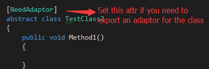
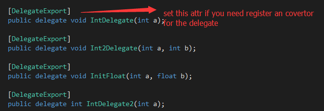
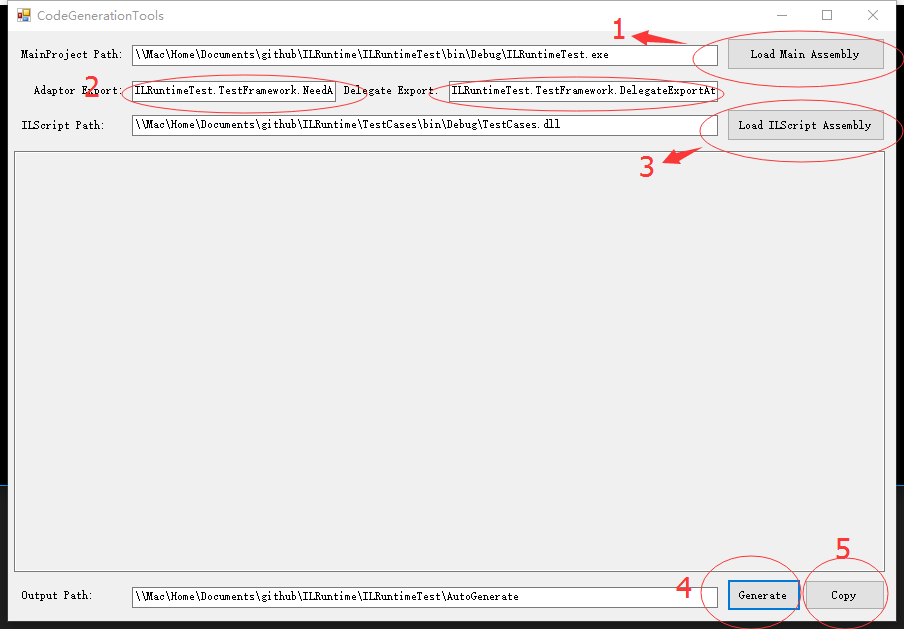
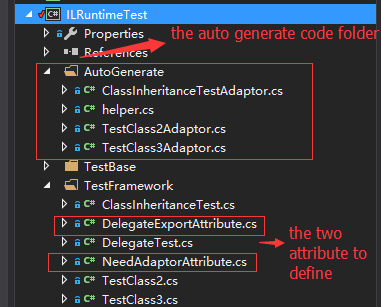

*CodeGenerationTools*
============
**What's this?**
============
This tool is used to generate some necessary code for ILRuntime.AppDomain, which include:
* AdaptorClass, an adaptor for a class who is inherited by ILType in your [ILScript Project]. e.g. "xxxAdaptor.cs"
* ILRuntimeHelper, a helper class to do some init for ILRuntime.AppDomain.
    * Init DelegateRegister, register the anonymous delegate which used in your [ILScript Project].
    * Init DelegateConvertor,register a convertor for the delegate which declared in your [Main Project(Unity Project)]
    * Init AdaptorRegister,register the adaptor class which you have generated before.

**How to Use**
============

***Prepare***

1.In your [MainProject],Mark the class you need inherite in you [ILScript] with [NeedAdaptor] attribute.

2.In your [MainProject],Mark the delegate you need to use in you [ILScript] with [DelegateExport] attribute.

***RunTools***

1. Click "Load Main Assembly" button to add the [Main Project] path to the tool;
2. Click "Load ILScript Assembly" button to add the [ILScript Project] path to the tool;
3. Click the "Generate" button to generate code.
4. Click the "Copy" button to copy the code to your [Main Project]'s folder named [Output Path]

**Example**
==============
If you still not sure about how to use this tool,you can take a look the [ILRuntimeTest] project.

